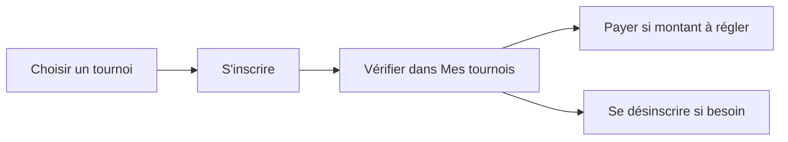
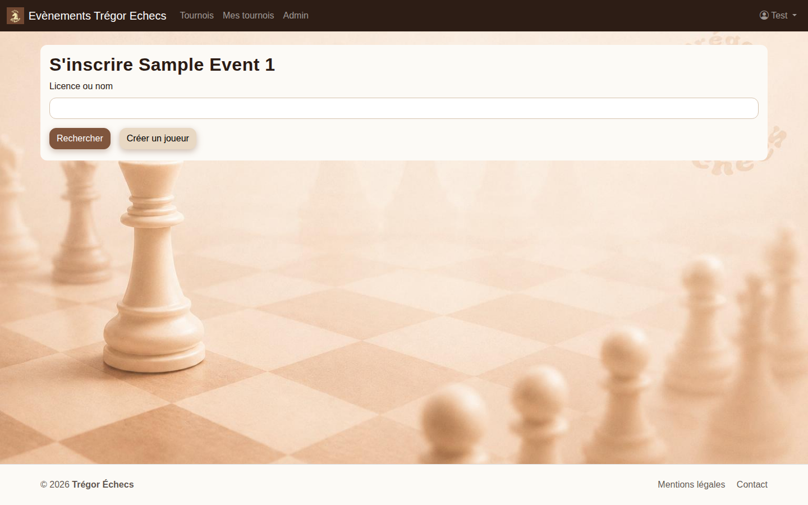
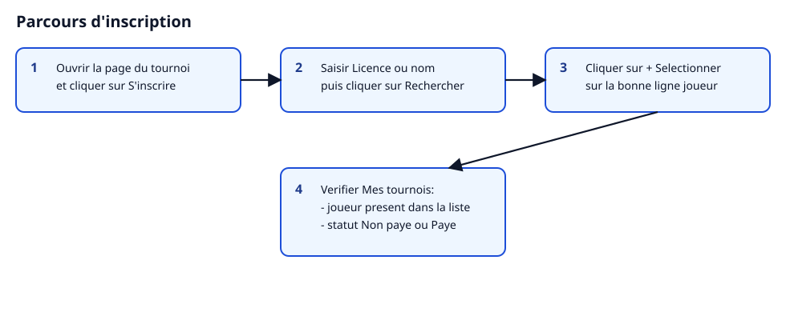
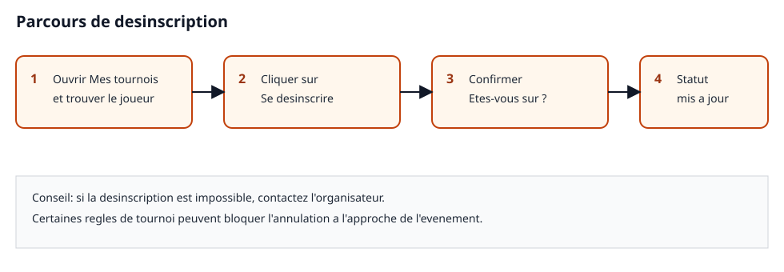

# Manuel utilisateur - Ticketchess

Ce guide explique, pas à pas, comment utiliser le site en tant que joueur ou parent :
- s'inscrire à un tournoi ;
- se désinscrire ;
- payer une inscription.

Ce document s'adresse à un public non technique.

## Avant de commencer

- Ouvrez le site dans votre navigateur.
- Connectez-vous lorsque le site vous le demande.
- Vérifiez que le tournoi est en statut **Inscriptions ouvertes**.

## Parcours rapide

1. Choisir un tournoi.
2. Cliquer sur **S'inscrire** et sélectionner le joueur.
3. Aller dans **Mes tournois** pour vérifier le statut.
4. Payer si un montant reste dû.
5. Se désinscrire si nécessaire.

## 1) S'inscrire à un tournoi

### Étapes

1. Ouvrez la page du tournoi souhaité.
2. Cliquez sur **S'inscrire**.
3. Dans la zone **Licence ou nom**, saisissez le nom du joueur ou son numéro de licence.
4. Cliquez sur **Rechercher**.
5. Sur la bonne ligne, cliquez sur **+ Sélectionner**.
6. Vérifiez le message **Inscription effectuée avec succès.**

### Si vous ne voyez pas le bouton S'inscrire

- Vous n'êtes peut-être pas connecté.
- Le tournoi peut être complet.
- Les inscriptions peuvent être fermées.

### Vérification après inscription

1. Ouvrez **Mes tournois**.
2. Vérifiez que le joueur apparaît dans le bon tournoi.
3. Pour un tournoi payant, le statut est en général **Non payé** tant que le règlement n'est pas fait.

## 2) Se désinscrire d'un tournoi

### Étapes

1. Ouvrez **Mes tournois**.
2. Repérez le tournoi et le joueur concernés.
3. Cliquez sur **Se désinscrire**.
4. Confirmez dans la fenêtre **Êtes-vous sûr ?**

### Résultat attendu

- Le joueur est retiré de la liste active.
- Si la désinscription est refusée (règle de tournoi), contactez l'organisation depuis la page de contact du site.

## 3) Payer une inscription

Quand un montant reste à régler, la section **Paiement** apparaît dans **Mes tournois**.

### Option A - Carte bancaire

1. Dans **Paiement par carte bancaire**, cliquez sur **Payer par carte**.
2. Effectuez le paiement sécurisé.
3. Revenez sur le site.
4. Vérifiez le message **Paiement effectué avec succès.** puis le statut **Payé**.

### Option B - Virement bancaire

1. Dans **Paiement par virement bancaire**, cliquez sur **Télécharger le RIB**.
2. Faites le virement depuis votre banque.
3. Indiquez votre nom et votre numéro FFE dans le libellé.
4. Le statut passe à **Payé** après validation par l'organisation.

### Option C - Paiement sur place

- Le site peut proposer le paiement en espèces ou par chèque sur place.

### Points importants

- Le prix peut évoluer avant le tournoi (voir la description du tournoi).
- En cas d'annulation, des frais bancaires peuvent s'appliquer pour les paiements par carte.

## Questions fréquentes

### Je ne vois pas le bouton S'inscrire

- Vérifiez la connexion.
- Vérifiez le statut du tournoi.
- Vérifiez que le quota d'inscriptions n'est pas atteint.

### Le statut reste Non payé après un virement

- Un délai de traitement est normal.
- Si le statut ne bouge pas, contactez l'organisation en indiquant le tournoi et le nom du joueur.

### Puis-je modifier une inscription ?

- Dans **Mes tournois**, le bouton **Modifier** peut apparaître selon le type de joueur et les règles de l'événement.

