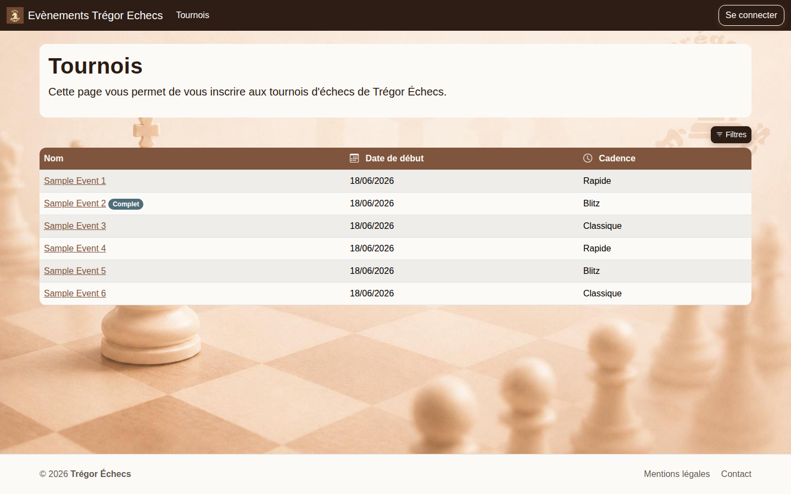
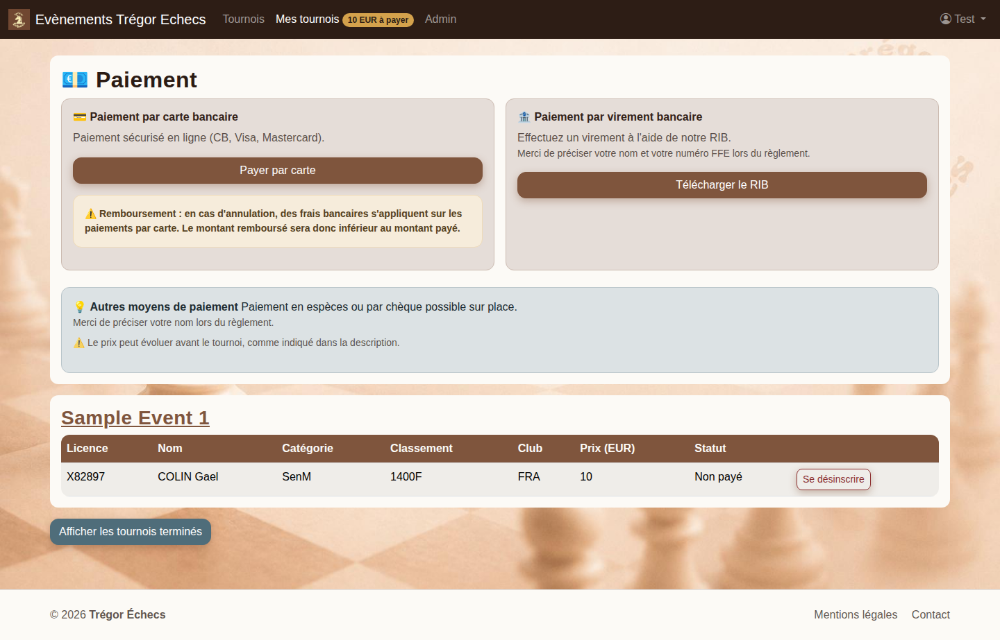

# Ticketchess - Guide rapide (1 page)

## Objectif
Ce document permet de réaliser rapidement les 3 actions principales :
- s'inscrire à un tournoi,
- se désinscrire,
- payer une inscription.

## 1) S'inscrire
1. Ouvrir le tournoi.
2. Cliquer sur **S'inscrire**.
3. Rechercher le joueur (nom ou licence).
4. Cliquer sur **+ Sélectionner**.
5. Vérifier le message de confirmation.

Points de contrôle :
- être connecté ;
- tournoi en statut **Inscriptions ouvertes** ;
- quota d'inscriptions non atteint.

## 2) Se désinscrire
1. Ouvrir **Mes tournois**.
2. Trouver le joueur.
3. Cliquer sur **Se désinscrire**.
4. Confirmer.

## 3) Payer
Quand un montant est dû, la section **Paiement** apparaît dans **Mes tournois**.

- **Carte** : cliquer sur **Payer par carte**.
- **Virement** : cliquer sur **Télécharger le RIB**, puis effectuer le virement avec nom + numéro FFE.
- **Sur place** : chèque / espèces selon les indications du site.

Vérification après paiement :
- message de succès ;
- statut du joueur = **Payé**.

## En cas de problème
- Bouton **S'inscrire** absent : vérifier connexion, statut du tournoi et quota.
- Statut non payé après virement : attendre le délai de traitement, puis contacter l'organisation.

## Captures utiles

