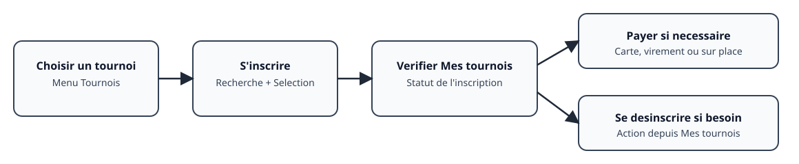
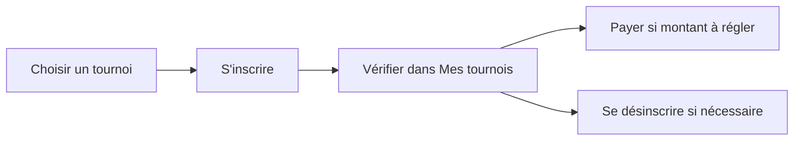
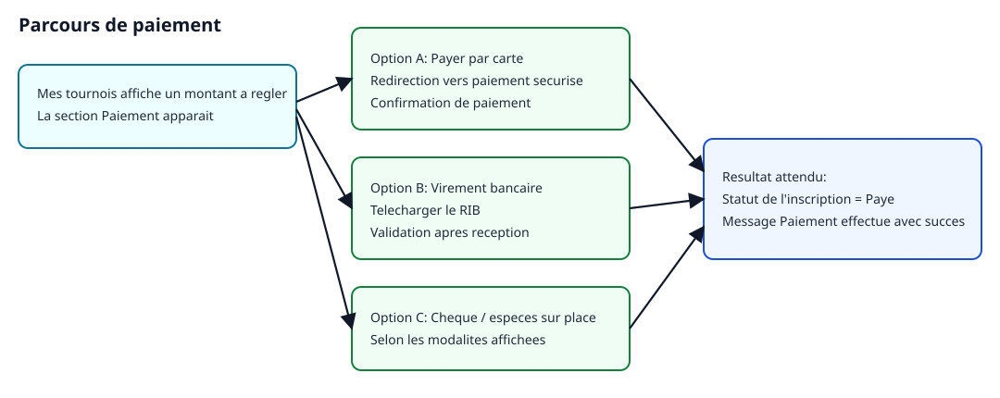

# Manuel utilisateur — Ticket Chess

Ce guide explique, pas à pas, comment utiliser le site en tant que joueur ou parent pour :

- s'inscrire à un tournoi ;
- se désinscrire ;
- payer une inscription ;
- s'inscrire au club ;
- comprendre la file d'attente.

Ce document s'adresse à un public non technique.

## Avant de commencer

- Ouvrez le site dans votre navigateur.
- Connectez-vous lorsque le site vous le demande.
- Vérifiez que le tournoi est en statut **Inscriptions ouvertes**.

## Parcours rapide

1. Choisissez un tournoi.
2. Cliquez sur **S'inscrire** et sélectionnez le joueur.
3. Allez dans **Mes tournois** pour vérifier le statut.
4. Payez si un montant reste dû.
5. Désinscrivez le joueur si nécessaire.

## 1) S'inscrire à un tournoi

### Étapes

1. Ouvrez la page du tournoi souhaité.
2. Cliquez sur **S'inscrire**.
3. Dans la zone **Licence ou nom**, saisissez le nom du joueur ou son numéro de licence.
4. Cliquez sur **Rechercher**.
5. Sur la bonne ligne, cliquez sur **+ Sélectionner**.
6. Vérifiez le message **Inscription effectuée avec succès**.

### Si vous ne voyez pas le bouton S'inscrire

- Vous n'êtes peut-être pas connecté.
- Le tournoi peut être complet (voir [File d'attente](#4-file-dattente) si elle est proposée).
- Les inscriptions peuvent être fermées.

### Vérification après inscription

1. Ouvrez **Mes tournois**.
2. Vérifiez que le joueur apparaît dans le bon tournoi.
3. Pour un tournoi payant, le statut est généralement **Non payé** tant que le règlement n'a pas été effectué.

## 2) Se désinscrire d'un tournoi

### Étapes

1. Ouvrez **Mes tournois**.
2. Repérez le tournoi et le joueur concernés.
3. Cliquez sur **Se désinscrire**.
4. Confirmez dans la fenêtre **Êtes-vous sûr ?**

### Résultat attendu

- Le joueur est retiré de la liste active.
- Si la désinscription est refusée (règle de tournoi), contactez l'organisation depuis la page de contact du site.

## 3) Payer une inscription

Quand un montant reste à régler, la section **Paiement** apparaît dans **Mes tournois**.

### Option A — Carte bancaire

1. Dans **Paiement par carte bancaire**, cliquez sur **Payer par carte**.
2. Effectuez le paiement sécurisé.
3. Revenez sur le site.
4. Vérifiez le message **Paiement effectué avec succès**, puis le statut **Payé**.

### Option B — Virement bancaire

1. Dans **Paiement par virement bancaire**, cliquez sur **Télécharger le RIB**.
2. Faites le virement depuis votre banque.
3. Indiquez votre nom et votre numéro FFE dans le libellé.
4. Le statut passe à **Payé** après validation par l'organisation.

### Option C — Paiement sur place

- Le site peut proposer le paiement en espèces ou par chèque sur place. Le jour J, les bénévoles enregistrent le règlement dans **Paiement & pointage**.

### Points importants

- Le prix peut évoluer avant le tournoi (voir la description du tournoi).
- En cas d'annulation, des frais bancaires peuvent s'appliquer pour les paiements par carte.

## 4) File d'attente

Quand un tournoi est **complet**, le site peut proposer une inscription en **file d'attente**.

1. Inscrivez-vous comme pour un tournoi ouvert.
2. Dans **Mes tournois**, la section **Mes inscriptions en file d'attente** indique votre **position**.
3. Vous serez contacté automatiquement si une place se libère.

Le message sur la page du tournoi précise si la file d'attente est disponible.

## 5) S'inscrire au club

Si votre club active cette fonctionnalité, le bouton **S'inscrire au club** apparaît dans le menu, que vous soyez connecté ou non.

### Étapes

1. Cliquez sur **S'inscrire au club**.
2. Recherchez le joueur par **numéro de licence FFE** ou créez une fiche **sans licence FFE**.
3. Choisissez les **options d'adhésion** (licence et prestations proposées par le club).
4. Confirmez la demande.

### Suivi

- **Mes adhésions au club** indique le statut de la demande (en attente, approuvée, payée…).
- Le règlement peut se faire par chèque ou en espèces, selon les indications du club.
- L'organisation peut vous contacter pour finaliser l'inscription.

## Questions fréquentes

### Je ne vois pas le bouton S'inscrire

- Vérifiez la connexion.
- Vérifiez le statut du tournoi.
- Vérifiez que le quota d'inscriptions n'est pas atteint (file d'attente éventuelle).

### Le statut reste Non payé après un virement

- Un délai de traitement est normal.
- Si le statut ne bouge pas, contactez l'organisation en indiquant le tournoi et le nom du joueur.

### Puis-je modifier une inscription ?

- Dans **Mes tournois**, le bouton **Modifier** peut apparaître selon le type de joueur et les règles de l'événement.

### Je ne vois pas S'inscrire au club

- Le club peut avoir désactivé cette fonctionnalité pour la saison en cours.

## Pour les organisateurs et arbitres

- [Manuel organisateur](MANUEL_ORGANISATEUR.md)
- [Synchroniser les inscriptions avec SharlyChess](SYNCHRO_SHARLYCHESS.md)
- [Liste de contrôle pour les bénévoles — Paiement & pointage](CHECKLIST_BENEVOLES_GUICHET.md)
