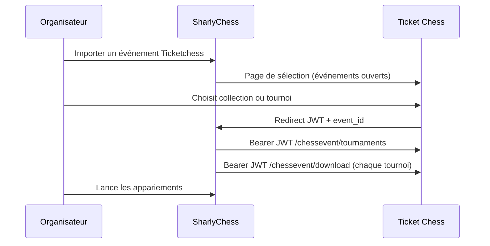

# Synchroniser les inscriptions avec SharlyChess

Ce guide s'adresse aux **organisateurs** et **arbitres** qui utilisent [SharlyChess](https://sharly-chess.com) pour gérer un tournoi après les inscriptions en ligne sur Ticket Chess.

## En bref

Ticket Chess envoie la liste des inscrits à SharlyChess via un **import d'événement** : un bouton dans Sharly ouvre Ticket Chess, vous choisissez une compétition ouverte, Sharly crée l'événement et importe **tous** les tournois (authentification JWT courte durée, sans mot de passe ChessEvent).

## Prérequis

- Une instance Ticket Chess accessible depuis l'ordinateur de l'arbitre.
- SharlyChess avec le module **ChessEvent** (import Ticketchess).
- Droits **EVENT_ADMIN** sur Ticket Chess pour la page de sélection.
- Tournois en statut **Inscriptions ouvertes** (`ACTIVE`).

> Pour autoriser un retour Sharly hors localhost, configurez éventuellement `sharly.callback.origins` dans `params.properties`.

---

## Étape 1 — Ticket Chess

Regroupez les tournois dans une **collection** si besoin, et ouvrez les inscriptions.

Optionnel : renseignez l'**Identifiant ChessEvent** de la collection (slug stable). Sinon Sharly utilise l'identifiant numérique.

### Joueurs amicaux / hors base FFE

Les inscrits custom (`@…`) et les licences absentes de la base FFE sont quand même exportés vers SharlyChess (données joueur custom, ou fiche minimale si introuvable).

---

## Étape 2 — SharlyChess

1. Accueil ou onglet Événements → **Importer un événement Ticketchess**.
2. URL Ticket Chess (défaut : instance du club, ex. `https://tournois.tregorechecs.fr`).
3. **Ouvrir Ticketchess**, connectez-vous, choisissez la compétition.
4. Retour automatique vers Sharly : création de l'événement + import de tous les tournois.

---

## Données transmises

Identité FFE/FIDE, email d'inscription, tarifs / paiements, pointage. Pas de téléphone.

---

## Dépannage

| Symptôme | Action |
|----------|--------|
| 401 Unauthorized | Relancer l'import (JWT expiré ~15 min) |
| Callback non autorisé | localhost / 127.0.0.1, ou `sharly.callback.origins` |
| Event not found (499) | Vérifier l'événement / collection sélectionné |

---

## Alternative : export PAPI

Menu du tournoi → **Exporter PAPI** → import fichier dans Sharly.

---

## Voir aussi

- [Manuel organisateur](MANUEL_ORGANISATEUR.md)
- [Liste de contrôle bénévoles](CHECKLIST_BENEVOLES_GUICHET.md)
