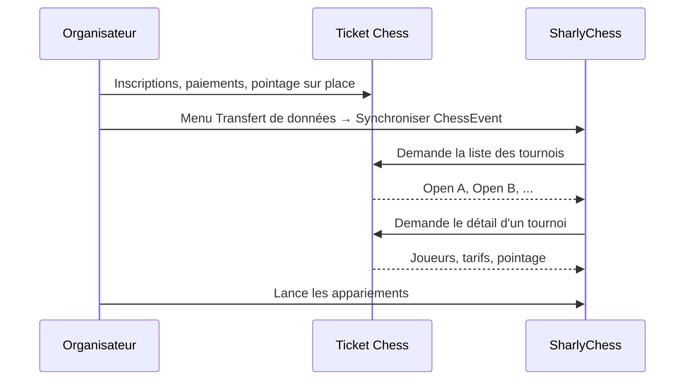

# Synchroniser les inscriptions avec SharlyChess

Ce guide s'adresse aux **organisateurs** et **arbitres** qui utilisent [SharlyChess](https://sharly-chess.com) pour gérer un tournoi après les inscriptions en ligne sur Ticket Chess.

## En bref

Ticket Chess peut envoyer la liste des inscrits à SharlyChess **automatiquement**, grâce au module d'extension **ChessEvent** intégré à Sharly. Vous n'avez pas besoin d'exporter manuellement un fichier PAPI (cette méthode reste disponible en solution de secours).

## Prérequis

- Une instance Ticket Chess accessible depuis l'ordinateur de l'arbitre (URL publique ou réseau local).
- SharlyChess installé, avec le module d'extension **ChessEvent** activé.
- Une version de SharlyChess permettant de **configurer l'URL du serveur ChessEvent** (voir [Version de SharlyChess](#version-de-sharlychess) ci-dessous).
- Droits d'**administration** sur Ticket Chess (pour configurer les identifiants).
- Les tournois créés dans Ticket Chess avec au moins une inscription.

> Aucune configuration supplémentaire dans `params.properties` n'est nécessaire : tout se fait dans l'interface d'administration. Ticket Chess expose une API compatible ChessEvent sous le chemin **`/chessevent`** (par ex. `https://echecs.monclub.fr/chessevent`).

---

## Étape 1 — Configurer Ticket Chess

La configuration comporte deux niveaux : la **collection** (événement regroupant plusieurs tournois) et chaque **tournoi**.

### Collection d'événements (recommandé)

Si votre compétition comporte plusieurs tournois (Open A, Open B, Jeunes…), regroupez-les dans une **collection**.

1. Connectez-vous → **Admin** → **Tous les événements**.
2. Cliquez sur **Créer une collection d'événements** ou ouvrez une collection existante (p. ex. *Open de Domloup 2026*).
3. Renseignez le champ **Identifiant ChessEvent (SharlyChess)**.

| Champ | Exemple | Rôle |
|-------|---------|------|
| Identifiant ChessEvent | `open_domloup_2026` | Code que Sharly enverra pour identifier l'événement |

Choisissez un identifiant **court, sans espace**, facile à retenir. Ce n'est pas un numéro FFE : c'est un libellé interne que vous définissez.

Si vous ne renseignez pas ce champ, Sharly pourra utiliser l'**identifiant numérique** de la collection (visible dans l'URL d'édition, p. ex. `/eventcollection/42` → `42`).

> **À ne pas confondre** : l'`event_id` n'est pas l'identifiant interne de la base Lucene/FFE ni un numéro de licence. Utilisez l'identifiant ChessEvent de la collection, son identifiant numérique Ticket Chess, ou — pour un tournoi isolé — l'identifiant numérique du tournoi seul (p. ex. `/event/4` → `4`, ce qui ne synchronisera que ce tournoi).

### Chaque tournoi — identifiants ChessEvent

Sur **chaque tournoi** concerné :

1. Ouvrez le tournoi → **Modifier**.
2. Onglet **Options**.
3. Renseignez (dans le même formulaire que les champs FFE, plus bas) :

| Champ Ticket Chess | Paramètre Sharly | Exemple |
|--------------------|------------------|---------|
| Utilisateur ChessEvent (SharlyChess) | `user_id` | `C69548` |
| Mot de passe ChessEvent (SharlyChess) | `password` | un mot de passe choisi par l'organisation |

Ces identifiants sont **distincts** de l'identifiant et du mot de passe **FFE** (utilisés pour l'envoi du fichier PAPI à la fédération depuis le même écran).

> Il suffit de configurer l'utilisateur et le mot de passe sur **au moins un tournoi** de la collection. Les autres tournois de la même collection seront accessibles avec les mêmes identifiants.

### Option de pointage

Toujours dans les options du tournoi (case **Pointage joueur**) :

| Pointage | Comportement lors de la synchronisation Sharly |
|----------|-----------------------------------------------|
| **Désactivé** | Tous les inscrits (non annulés) sont envoyés. Le champ de pointage indique si le joueur a été marqué présent. |
| **Activé** | Seuls les joueurs **pointés** dans **Paiement & pointage** sont envoyés à Sharly. |

Activez le **pointage** si vous souhaitez effectuer la synchronisation **après** le passage des joueurs à l'accueil (voir la [liste de contrôle pour les bénévoles](CHECKLIST_BENEVOLES_GUICHET.md) et **Paiement & pointage** dans le menu du tournoi).

---

## Étape 2 — Configurer SharlyChess

Dans SharlyChess, ouvrez le module d'extension **ChessEvent** (menu **Transfert de données** → **Importer depuis ChessEvent**, ou équivalent selon votre version).

| Paramètre Sharly | Valeur |
|------------------|--------|
| **URL du serveur ChessEvent** | URL de base **avec le suffixe `/chessevent`**, p. ex. `https://echecs.monclub.fr/chessevent` ou `http://localhost:8080/chessevent` en local |
| **Évènement ChessEvent** (`event_id`) | Identifiant ChessEvent de la collection (`open_domloup_2026`) **ou** identifiant numérique de la collection ou du tournoi |
| **Utilisateur** (`user_id`) | Identique à l'*Utilisateur ChessEvent* saisi dans Ticket Chess |
| **Mot de passe** (`password`) | Identique au *Mot de passe ChessEvent* saisi dans Ticket Chess |
| **Nom du tournoi** (à l'import) | **Exactement** le libellé du tournoi dans Ticket Chess (respect des majuscules, accents, espaces) |

Lancez ensuite la **synchronisation** et choisissez le tournoi dans la liste proposée (les intitulés correspondent à ceux des tournois dans Ticket Chess).

### URL du serveur — points importants

| Contexte | URL correcte | URL incorrecte (ne fonctionne pas) |
|----------|--------------|-------------------------------------|
| Production HTTPS | `https://mon-domaine.fr/chessevent` | `https://mon-domaine.fr` (sans `/chessevent`) |
| Développement local | `http://localhost:8080/chessevent` | `https://localhost:8080/chessevent` (Ticket Chess écoute en HTTP) |
| Ancien serveur ChessEvent | `https://www.chessevent.com/download` | — |

Utilisez **`http://`** en local sauf si vous avez configuré TLS devant Ticket Chess.

### Version de SharlyChess

La version **installée officiellement** (Windows, Linux…) se connecte par défaut au serveur ChessEvent hébergé (`chessevent.com`) : le code est compilé dans l'exécutable et l'URL n'est en général **pas modifiable** dans l'interface.

Pour synchroniser avec **votre propre instance Ticket Chess**, il faut une version de SharlyChess où l'URL du serveur ChessEvent est **configurable** (fork de développement ou future version officielle). Sans cela, Sharly ne contactera pas Ticket Chess même si la configuration côté Ticket Chess est correcte.

---

## Exemple complet

**Ticket Chess**

- Collection *Open de Domloup 2026* → identifiant ChessEvent : `open_domloup_2026`
- Tournoi *Open A* → utilisateur `C69548`, mot de passe `mon-secret-arbitre`
- Tournoi *Open B* → mêmes identifiants (ou seulement sur Open A)
- Pointage : activé → les bénévoles pointent les joueurs dans **Paiement & pointage** avant la synchronisation

**SharlyChess**

- URL du serveur ChessEvent : `https://ticketchess.monclub.fr/chessevent`
- Évènement ChessEvent : `open_domloup_2026`
- Utilisateur : `C69548`
- Mot de passe : `mon-secret-arbitre`
- Importer → nom du tournoi : `Open A` (identique au libellé Ticket Chess)

### Exemple en local (développement)

| Paramètre | Valeur |
|-----------|--------|
| URL du serveur ChessEvent | `http://localhost:8080/chessevent` |
| Évènement ChessEvent | `4` (identifiant numérique du tournoi présent dans l'URL, ou identifiant ChessEvent personnalisé pour une collection de tournois) |
| Utilisateur / mot de passe | Ceux configurés dans les options du tournoi Ticket Chess |
| Nom du tournoi à l'import | `3ème Rapide de Perros-Guirec` (libellé exact) |

---

## Données transmises à Sharly

Pour chaque joueur, Ticket Chess envoie notamment :

- identité (nom, prénom, licence FFE, FIDE, club, catégorie, Elo) ;
- adresse électronique de la personne qui a inscrit le joueur ;
- tarif, montant déjà payé ;
- pointage (marquage de présence) si le joueur a été marqué présent dans **Paiement & pointage**.

Les numéros de téléphone ne sont pas enregistrés dans Ticket Chess : ce champ est donc vide dans Sharly.

---

## Dépannage

| Message / symptôme | Cause probable | Action |
|--------------------|----------------|--------|
| *User not found* (497) | `user_id` inconnu | Vérifier *Utilisateur ChessEvent* sur au moins un tournoi |
| *Unauthorized* (401) | Mot de passe incorrect | Vérifier *Mot de passe ChessEvent* |
| *Access forbidden* (403) | Identifiants valides mais pas pour cet événement | Vérifier que les identifiants sont sur un tournoi de la bonne collection |
| *Event not found* (499) | `event_id` incorrect | Vérifier l'identifiant ChessEvent de la collection ou l'identifiant numérique (`/eventcollection/…`) |
| *Tournament not found* (498) | Le nom du tournoi ne correspond pas | Saisir **exactement** le nom du tournoi Ticket Chess (pas un raccourci du type `open`) |
| *Connection au serveur ChessEvent échouée* | URL incorrecte | Vérifier le suffixe **`/chessevent`**, le protocole (`http` en local), que Ticket Chess est démarré |
| Erreur SSL (*wrong version number*) | `https://` sur un serveur HTTP | Remplacer par `http://` en local, ou configurer TLS en production |
| *Une erreur s'est produite. Consultez les logs.* (Sharly) | Données JSON rejetées par Sharly | Consulter `logs/sharly-chess.log` ; le fichier `tmp/chessevent/invalid-chessevent-data.json` contient la dernière réponse reçue |
| Liste vide avec pointage activé | Aucun joueur pointé | Pointer les joueurs dans **Paiement & pointage** avant de relancer la synchronisation |
| Sharly ne contacte pas Ticket Chess | Version Sharly sans URL configurable | Utiliser une version Sharly permettant de saisir l'URL du serveur ChessEvent (voir [Version de SharlyChess](#version-de-sharlychess)) |

### Consulter les logs Sharly

Emplacement typique sous Windows :

- Installation officielle : `C:\Users\<vous>\Documents\Sharly Chess\logs\sharly-chess.log`
- Fork / développement : `logs/sharly-chess.log` à la racine du dépôt SharlyChess

Recherchez les lignes contenant `chessevent` ou `Tournament importer` pour le détail de l'erreur.

---

## Alternative : export PAPI manuel

Si la synchronisation ChessEvent n'est pas disponible ou échoue :

1. Sur la page du tournoi → menu **⋯** → **Exporter PAPI**.
2. Importez le fichier `.papi` dans SharlyChess.

Cette méthode ne filtre pas automatiquement selon le pointage (contrairement à l'API ChessEvent quand le pointage est activé).

---

## Voir aussi

- [Manuel organisateur](MANUEL_ORGANISATEUR.md)
- [Liste de contrôle pour les bénévoles — Paiement & pointage](CHECKLIST_BENEVOLES_GUICHET.md)
- [Manuel utilisateur](MANUEL_UTILISATEUR.md) — parcours des joueurs et des parents
